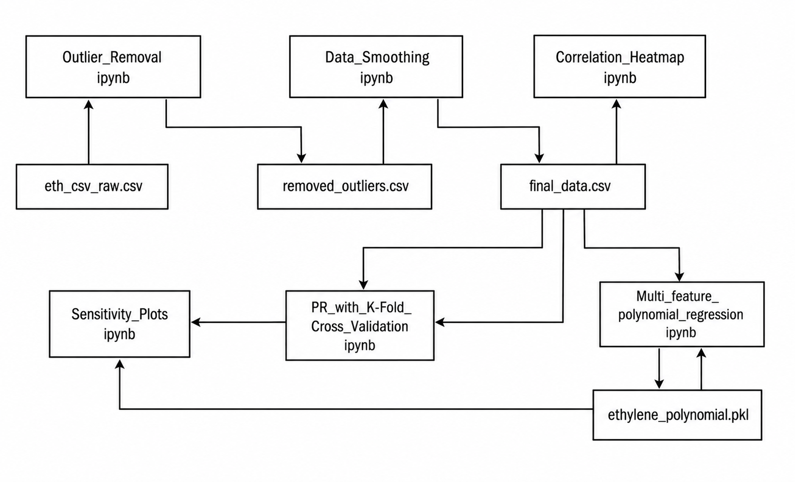
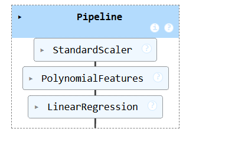
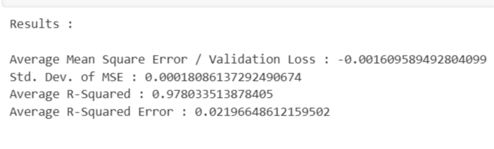

# Predicting Ethylene Gas Concentration Using Machine Learning

This repository contains the code, notebooks, images, and documents for a minor project on **predicting ethylene (C₂H₄) gas concentration using machine learning** with multivariate gas sensor data. The project focuses on building an economical, accurate, and scalable predictive model using **polynomial regression**, along with robust data preprocessing and validation.

## Project Overview

Ethylene is a key gas in:

- **Agriculture** – controls fruit ripening and shelf life in storage and transport.  
- **Industrial safety** – acts as a flammable gas with explosion risk at high concentrations.  
- **Environmental monitoring** – contributes to air quality and VOC levels.  

Traditional gas detection systems are typically **threshold-based**, giving an alarm only after concentration crosses a preset limit and providing no prediction of future levels. This project replaces that reactive behavior with a **predictive ML model** that estimates ethylene concentration from low‑cost MOS and Taguchi gas sensor readings.

### System Architecture


The system takes analog readings from a gas sensor array (e.g., TGS2610, TGS2602, TGS2600, TGS2620), feeds them to the trained machine-learning model, and outputs the predicted ethylene concentration in ppm.

## Repository Structure

- `Minor_Project_Report.pdf`  
  Full project report with detailed background, methodology, results, and discussion.

- `Minor_Project_PPT.pptx`  
  Presentation slides summarizing the project motivation, pipeline, and key results.

- `Minor_Project.pdf`  
  Conference-style paper describing the system architecture, ML pipeline, and experimental results in a compact format.

- `Outlier_Removal.ipynb`  
  Jupyter notebook for detecting and removing outliers from the raw sensor dataset using statistical techniques (e.g., IQR-based filtering).

- `Data_Smoothing.ipynb`  
  Notebook for noise reduction and smoothing of sensor signals (e.g., Savitzky–Golay filtering) and preparing cleaned time series data.

- `Correlation_Heatmap.ipynb`  
  Notebook for exploratory data analysis (EDA), computing feature correlations, and visualizing correlation heatmaps to guide feature selection.

- `Multi_Feature_Polynomial_Regression.ipynb`  
  Core notebook implementing the **multi-feature polynomial regression model**, including feature scaling, polynomial feature expansion, training, and evaluation.

- `PR_With_K-fold_Cross_Validation.ipynb`  
  Notebook that trains and evaluates the polynomial regression model with **K-fold cross-validation** and computes metrics such as MSE, RMSE, MAE, and R².

- `Sensitivity_Plots.ipynb`  
  Notebook for generating sensitivity plots for individual sensors, showing how sensor responses vary with ethylene concentration.

- `images/`  
  Folder containing all figures used in the README:
  - `Pipeline.png`
  - `system_architectre.png`
  - `Project Structure.png`
  - `Correlation Heatmap.png`
  - `Data Smoothing.png`
  - `Sensitivity Plots.png`
  - `MultiFeature Polynomial Regressio.png`
  - `Result.png`
  - `Work Flow Diagram.png`

> Note: Some notebooks appear in duplicate (e.g., `1.Outlier_Removal.ipynb`, `Multi_Feature_Polynomial_Regression.ipynb`) due to multiple exports; you can keep a single canonical copy of each before pushing to Git.

### Project Workflow Between Notebooks



This diagram shows how raw CSV data flows through the notebooks (outlier removal, smoothing, correlation analysis, model training, cross validation, sensitivity plots) and ends with a saved model file (e.g., `ethylene_polynomial.pkl`).

## Methodology

The end‑to‑end pipeline follows a standard supervised ML workflow tailored to multivariate gas sensor data.

### Overall ML Pipeline



1. **Data Acquisition & EDA**  
   - Load multivariate readings from MOS/Taguchi gas sensors along with reference ethylene concentration (ppm).  
   - Perform EDA using histograms, distribution plots, and summary statistics to understand sensor ranges and variability.  
   - Use correlation analysis and heatmaps to identify sensors most informative for predicting ethylene concentration.

2. **Data Preprocessing**  
   - **Handling missing values**: Remove or impute incomplete records to obtain consistent feature vectors.  
   - **Outlier removal**: Apply the **Interquartile Range (IQR)** method to identify and remove extreme values that could skew the model.  
   - **Noise reduction / smoothing**: Use smoothing filters (e.g., Savitzky–Golay) to reduce high-frequency noise in sensor signals.  
   - **Feature scaling**: Standardize features so they share a common scale, improving numerical stability and model convergence.

#### Example of Data Smoothing


3. **Feature Engineering**  
   - Select the most informative sensor channels based on correlation with the target and redundancy between sensors.  
   - Apply **polynomial feature expansion** (e.g., squared terms, interaction terms) to capture nonlinear relationships between sensor readings and ethylene concentration.

#### Correlation Heatmap of Features


4. **Model Development**  
   - Use **polynomial regression** (implemented via scikit‑learn’s polynomial features + linear regression) as the core model.  
   - Train the model on preprocessed, expanded features to learn the mapping from sensor data to ethylene concentration.  
   - Vary polynomial degree to balance underfitting vs overfitting.

#### Polynomial Regression Pipeline


5. **Validation & Performance Metrics**  
   - Evaluate using **K‑fold cross-validation** to obtain robust performance estimates on unseen data.  
   - Compute regression metrics:  
     - Mean Squared Error (MSE)  
     - Root Mean Squared Error (RMSE)  
     - Mean Absolute Error (MAE)  
     - Coefficient of determination (R²)  
   - Visualize actual vs predicted values, error distributions, and metric trends vs polynomial degree.

#### Actual vs Fitted Distribution



6. **Sensor Sensitivity Analysis**  
   - Generate sensitivity plots to study how each sensor’s normalized response varies with ethylene concentration.  
   - Use these plots to verify sensor behavior and the usefulness of each feature.

#### Sensor Sensitivity to Ethylene Concentration


7. **Model Export & Deployment Potential**  
   - Save the trained model (e.g., using `pickle`) for later use on new sensor readings.  
   - The system is designed to be lightweight enough for near real‑time prediction and suitable for integration with IoT and edge devices in future work.

## Technologies Used

- **Programming language**: Python  
- **Major libraries**:  
  - `pandas` – data loading and manipulation  
  - `numpy` – numerical computation  
  - `scikit-learn` – preprocessing, polynomial features, regression models, cross-validation  
  - `scipy` – signal processing and filtering  
  - `matplotlib`, `seaborn` – plotting and visualization  
- **Environment**: Jupyter Notebook-based workflow with modular notebooks for each stage (outlier removal, smoothing, correlation, modelling, validation, sensitivity, etc.).

## How to Run the Project

1. **Clone the repository**

```bash
git clone https://github.com/<your-username>/<your-repo-name>.git
cd <your-repo-name>
```

2. **Create and activate a virtual environment (recommended)**

```bash
python -m venv venv
source venv/bin/activate  # On Windows: venv\Scripts\activate
```

3. **Install dependencies**

Create a `requirements.txt` with at least:

```text
numpy
pandas
scikit-learn
scipy
matplotlib
seaborn
jupyter
```

Then run:

```bash
pip install -r requirements.txt
```

4. **Launch Jupyter Notebook**

```bash
jupyter notebook
```

Open the notebooks roughly in this order for a full run:

1. `1.Outlier_Removal.ipynb`  
2. `2.Data_Smoothing.ipynb`  
3. `3.Correlation_Heatmap.ipynb`  
4. `Multi_Feature_Polynomial_Regression.ipynb`  
5. `PR_With_K-fold_Cross_Validation.ipynb`  
6. `Sensitivity_Plots.ipynb`  

## Applications and Future Scope

The developed model and pipeline are general enough to be adapted to:

- **Smart agriculture** – predicting ethylene levels in fruit storage and transport to reduce post-harvest losses.  
- **Industrial safety** – early warning for ethylene accumulation in chemical plants, storage tanks, and pipelines.  
- **Environmental monitoring** – tracking ethylene as part of VOC and air-quality monitoring systems.  

Possible future extensions include:

- Using more advanced models (Random Forests, SVR, gradient boosting, lightweight neural networks).  
- Incorporating environmental features (temperature, humidity, pressure) into the model.  
- Real-time IoT integration for continuous remote monitoring.  
- Extending to **multi-gas prediction** using the same sensor array and ML framework.
